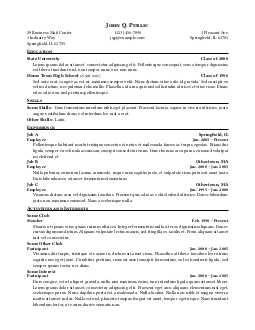

# KRes LaTeX Template

This repository contains the LaTeX class files that I use to format my resume. A sample resume source file is included in the `sample/` directory.

You can view a preview image [here](./sample/JQPResume.png)

## Dependencies
This class file is designed to work under a TeXLive distribution. It depends on:

- `article`
- `fontenc`
- `hyperref`
- `navigator`
- `libertine`
- `multicol`
- `microtype`
- `xstring`
- `changepage`
- `xparse`
- `ifthen`

All of these packages should be included in a standard TeXLive distribution.
